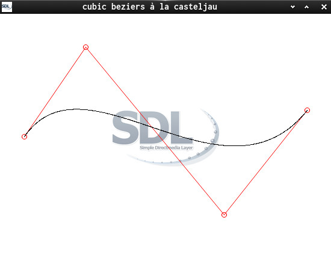

This is a C-SDL Drawing Demo

it does demonstrate how...

- to apply [De Casteljau's algorithm](https://en.wikipedia.org/wiki/De_Casteljau%27s_algorithm) on quadratic [Bézier curves](https://en.wikipedia.org/wiki/B%C3%A9zier_curve).

Screenshot:  

## Building

Linking against: `SDL2 SDL2_image SDL2_gfx` 

arch: `sudo pacman -S sdl2 sdl2_gfx sdl2_image`

On other Distros look out for ... and so on: 
deb/apt: libsdl2, libsdl2-dev 
rpm/yum: SDL2, SDL2-devel 

`git clone git@github.com:Acry/SDL2-Pong.git` 
`cd SDL2-Pong`

`make` will build native Linux executeables. 
`1`, `2`, `3` are wip builds. 
`casteljau` is the final build 

## Useful links:

[My Homepage](https://acry.github.io/)

[Nils Pipenbrinck aka Submissive/Cubic & \$eeN](http://www.cubic.org/docs/bezier.htm) 
[SDL2](https://www.libsdl.org/) 
[SDL-Discourse](https://discourse.libsdl.org) 
